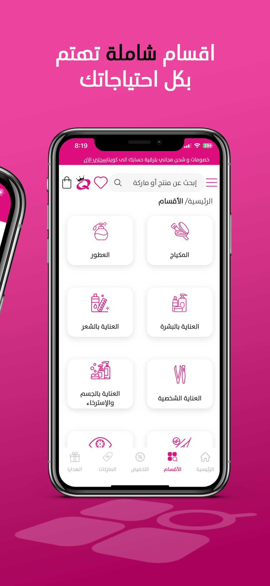
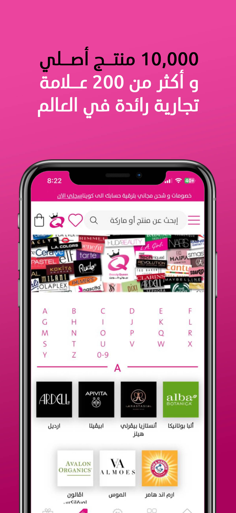
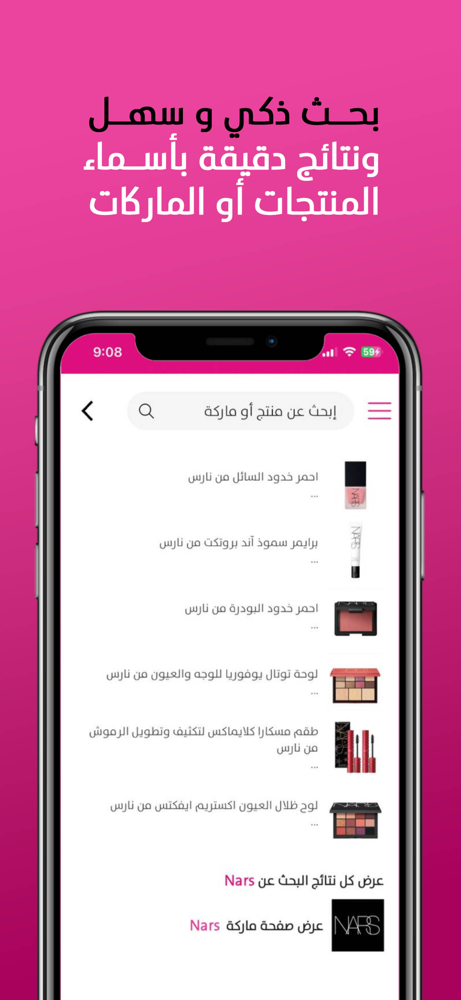
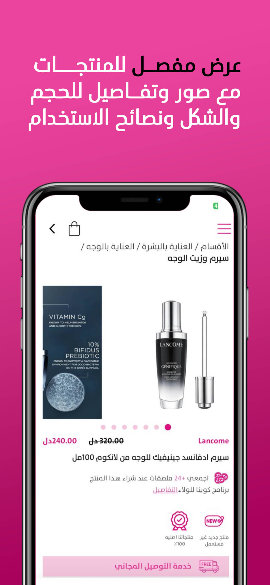
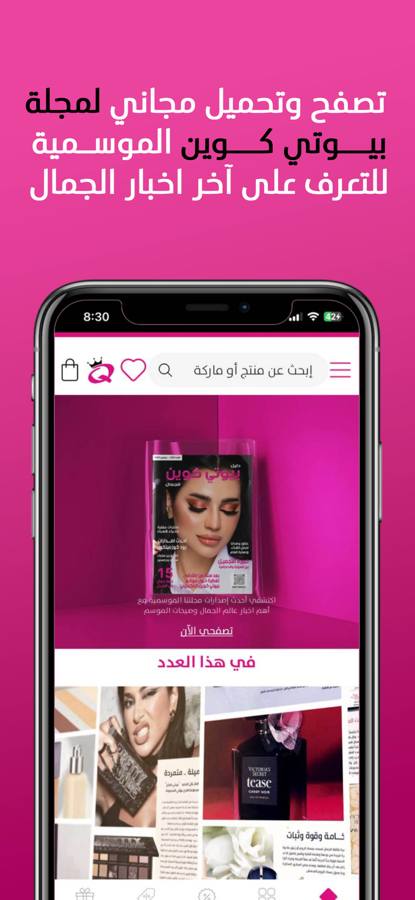

# BeautyQueen - Flutter eCommerce App

BeautyQueen is a mobile eCommerce app built with Flutter. It allows users to browse and purchase a variety of shopping items for women. The app includes product search, descriptions, special offers, gifts on products, and gift cards for users. Users can add products to the shopping cart, complete their order, and follow the status of their orders. With a user-friendly design, the app provides a seamless shopping experience.

## Features

- **Search**
- **Offers**
- **Gifts**
- **Magazine**
- **Sections Of Product**
- **Brands Of Product**
- **Shopping Cart**
- **Order Completion**
- **Order Completion**
- **Order Tracking**

## Screenshots

[//]: # (![Home Screen]&#40;assets/readme/1.jpg&#41;)









## App Icons
<a href="https://apps.apple.com/eg/app/beauty-queen-shop-your-beauty/id6477649645">
  
</a>
<a href="https://play.google.com/store/apps/details?id=com.beauty.beauty_queen">
  
</a>

## Getting Started

To run this project locally, follow the instructions below:

### Prerequisites

1. Install Flutter on your machine:  
   [Flutter Installation Guide](https://flutter.dev/docs/get-started/install)

2. Set up an emulator or a physical device to test the app.

### Installing

1. Clone the repository:

   ```bash
   git clone https://github.com/a0Max/Beauty-Queen.git

2. Navigate to the project directory:

   ```bash
   cd Beauty-Queen
3. Install dependencies:

   ```bash
   flutter pub get
4. Run the app on an emulator or physical device:

   ```bash
   flutter run

